# 📊 ¡Hola! Soy Julio Rodríguez Díaz

### Aspirante a Analista de Datos | SQL Enthusiast | Aprendiendo a convertir datos en insights

---

## 🎯 Sobre Mí

Estudiante apasionado por el análisis de datos, enfocado en desarrollar habilidades sólidas en SQL y herramientas de análisis. Mi objetivo es transformar datos complejos en información valiosa para la toma de decisiones.

🔍 Actualmente trabajando en mejorar mis habilidades mediante práctica constante en plataformas como DataLemur y LeetCode.

---

## 🛠️ Stack Técnico

### En Desarrollo Activo

### Próximo en el Roadmap

---

## 📈 Mi Roadmap de Aprendizaje

```mermaid
graph LR
    A[SQL + Excel] --> B[Python para Análisis]
    B --> C[Power BI / Tableau]
    C --> D[Proyectos Reales]
```

### Fase Actual: Fundamentos 🎓
- ✅ Consultas SQL básicas e intermedias
- ✅ Joins, agregaciones y subconsultas
- 🔄 Excel: fórmulas avanzadas y tablas dinámicas
- 🔄 Resolución de problemas en DataLemur y LeetCode

### Próximas Fases:
- 📊 **Python**: pandas, numpy, matplotlib
- 📉 **Visualización**: Power BI y Tableau
- 🎯 **Proyectos**: Análisis exploratorios y dashboards

---

## 💻 Proyectos Destacados

### 🗃️ SQL Practice Repositories
- **DataLemur Solutions**: Ejercicios de SQL enfocados en problemas del mundo real
- **LeetCode SQL**: Resolución de problemas algorítmicos con SQL

> 🚀 Próximamente: Proyectos de análisis de datos con datasets reales

---

## 🌐 Socials

---

## 📊 GitHub Stats

 
 

### 🔝 Top Contributed Repo

---

<!-- Proudly created for Data Analytics journey -->
